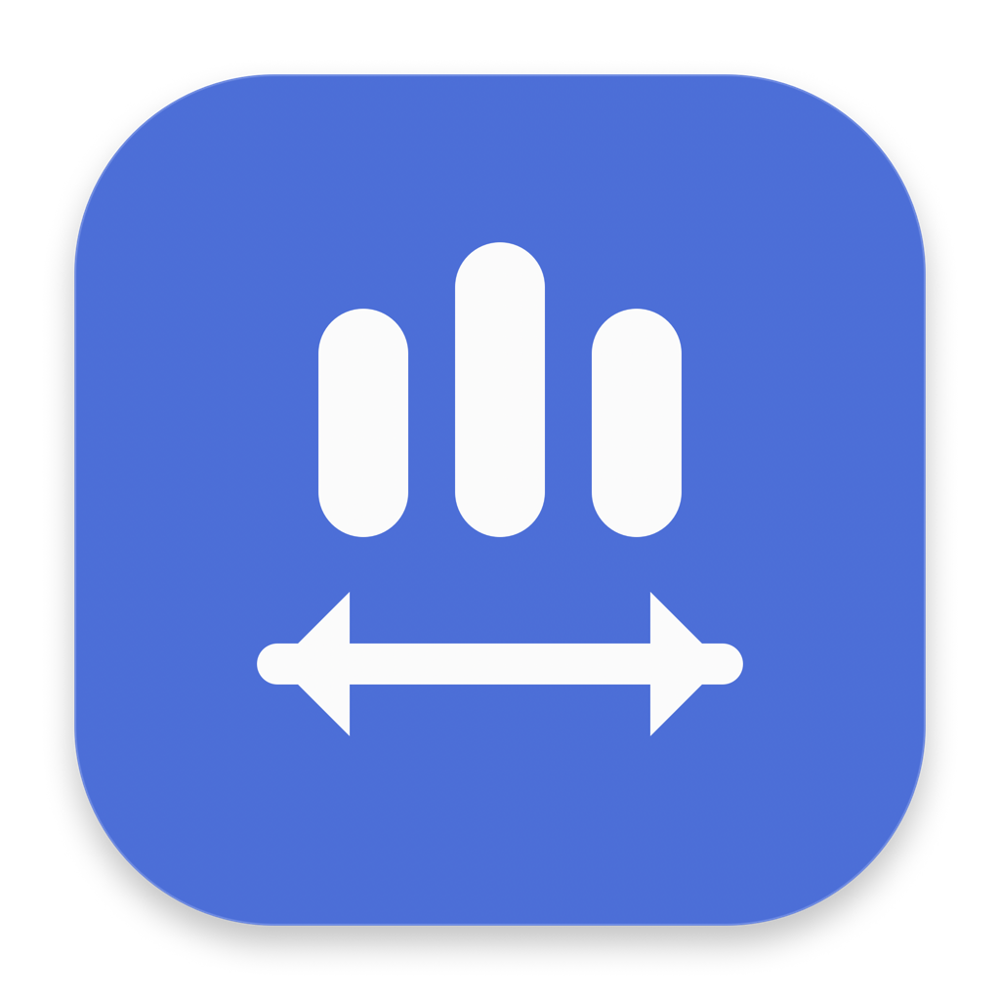

# Three Finger Switch



A focused macOS menu-bar utility that makes three-finger horizontal swipes behave like app history:

- swipe left → previous app;
- swipe right → next app;
- click or Command-Tab to an app → make it the newest item in history;
- reverse direction → return through that history without creating a two-app loop.

It switches immediately, without showing the Command-Tab interface or waiting for another click.

## Features

- Exact three-finger detection on built-in and supported external trackpads
- Bidirectional recent-app history across all open regular applications
- Adjustable sensitivity and reversible directions
- Per-app exclusions
- Optional destination app indicator
- Drag protection, rapid-swipe handling, and sleep/wake recovery
- Launch at Login
- Native light and dark appearance

## Download and install

### Option 1: Download the ready-built app

1. Open the [latest release](https://github.com/ibrahim11elian/Three-Finger-Switch/releases/latest).
2. Download `Three-Finger-Switch-<version>.zip` from **Assets**. Do not download GitHub's
   automatically generated “Source code” archives unless you intend to build the app yourself.
3. Double-click the downloaded ZIP to extract it.
4. Drag **Three Finger Switch.app** into the **Applications** folder.
5. Open it from **Applications**. The app then lives in the menu bar.

Until Developer ID credentials are configured, GitHub builds are ad-hoc signed. On the first
launch, macOS may say that it cannot verify the developer. If that happens:

1. Click **Done** in the warning.
2. Open **System Settings → Privacy & Security**.
3. Scroll to **Security**, click **Open Anyway** beside Three Finger Switch, then confirm **Open**.

This approval is required only once for that build. A future Developer ID-notarized release will
open normally without these additional steps.

### Option 2: Build from source

1. Install Apple's Command Line Tools if needed:

   ```sh
   xcode-select --install
   ```

2. Download the source using either method:

   - On GitHub, select **Code → Download ZIP**, extract it, then open the extracted folder in
     Terminal.
   - Or clone it from Terminal:

     ```sh
     git clone https://github.com/ibrahim11elian/Three-Finger-Switch.git
     cd Three-Finger-Switch
     ```

3. Build the app:

   ```sh
   ./scripts/render-app-icon.sh
   ARCHS="arm64 x86_64" ./scripts/build-app.sh
   ```

4. Drag `outputs/Three Finger Switch.app` into **Applications**, then open it.

The build is ad-hoc signed and is intended for local use.

## Trackpad setup

In **System Settings → Trackpad → More Gestures**, set **Swipe between full-screen applications** to
four fingers or turn it off. This prevents macOS from also changing Spaces when you use this app’s
three-finger gesture.

The app does not need Accessibility, Screen Recording, or network access.

## Public releases

GitHub Actions runs checks for each pull request. Pushing a version tag creates a universal GitHub
Release containing the app ZIP and its SHA-256 checksum. Without release credentials, the workflow
creates an ad-hoc-signed build and users follow the one-time **Open Anyway** instructions above.

When Developer ID credentials are configured, the same workflow signs, notarizes, and staples the
app so it opens without that warning.

To enable notarized releases:

1. Join the Apple Developer Program and create a **Developer ID Application** certificate.
2. Export that certificate and private key as a password-protected `.p12` file.
3. Choose a permanent bundle identifier and add it as the repository variable
   `BUNDLE_IDENTIFIER`. Do this before the first release because changing it later resets preferences
   and Launch at Login registration.
4. Add these GitHub Actions secrets:

   - `APPLE_DEVELOPER_ID_P12_BASE64` — the `.p12` encoded with `base64 -i certificate.p12`;
   - `APPLE_DEVELOPER_ID_P12_PASSWORD`;
   - `APPLE_DEVELOPER_ID_APPLICATION` — the full identity, for example
     `Developer ID Application: Your Name (TEAMID)`;
   - `APPLE_CI_KEYCHAIN_PASSWORD` — a strong throwaway password used for the CI keychain;
   - `APPLE_ID`;
   - `APPLE_TEAM_ID`;
   - `APPLE_APP_SPECIFIC_PASSWORD`.

For a release from your own Mac, store notarization credentials in Keychain, then run:

```sh
xcrun notarytool store-credentials "three-finger-switch"
CODESIGN_IDENTITY="Developer ID Application: Your Name (TEAMID)" \
NOTARY_PROFILE="three-finger-switch" \
./scripts/package-release.sh
```

Create a release by pushing a tag that matches the app version:

```sh
version=$(/usr/libexec/PlistBuddy -c 'Print :CFBundleShortVersionString' AppResources/Info.plist)
git tag "v$version"
git push origin "v$version"
```

## Privacy

Three Finger Switch runs locally. It does not collect analytics, send network requests, read screen
contents, or store a history of the apps you use. Preferences stay in macOS `UserDefaults`.

## Compatibility and private API

macOS does not provide a public global API for exact trackpad contact counts. Three Finger Switch
dynamically loads Apple’s private `MultitouchSupport` framework for that one purpose. This means:

- Mac App Store distribution is not supported;
- a future macOS update could require a compatibility update;
- every release should be tested on the newest macOS before publishing.

Developer ID notarization is separate from Mac App Store review and is the intended distribution
path for GitHub downloads.

## Uninstall

Turn off **Launch at Login** in Settings, quit from the menu-bar item, then move
`/Applications/Three Finger Switch.app` to the Trash.

## License

MIT — see [LICENSE](LICENSE).
